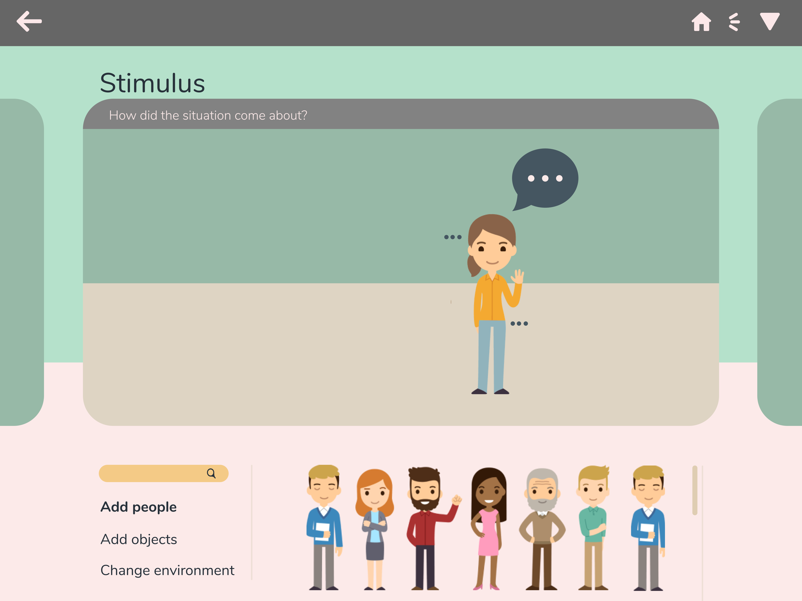
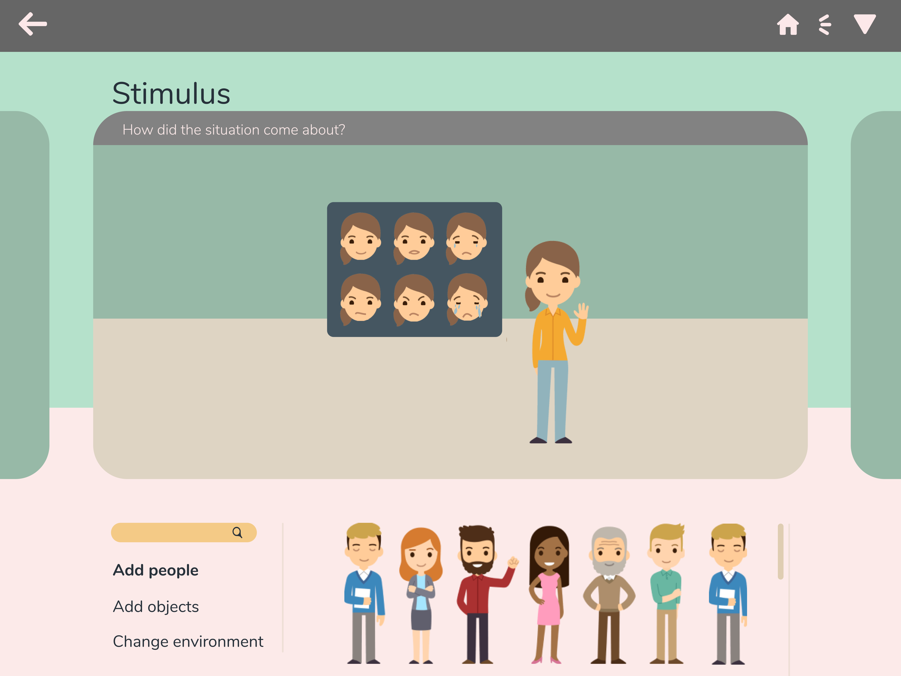
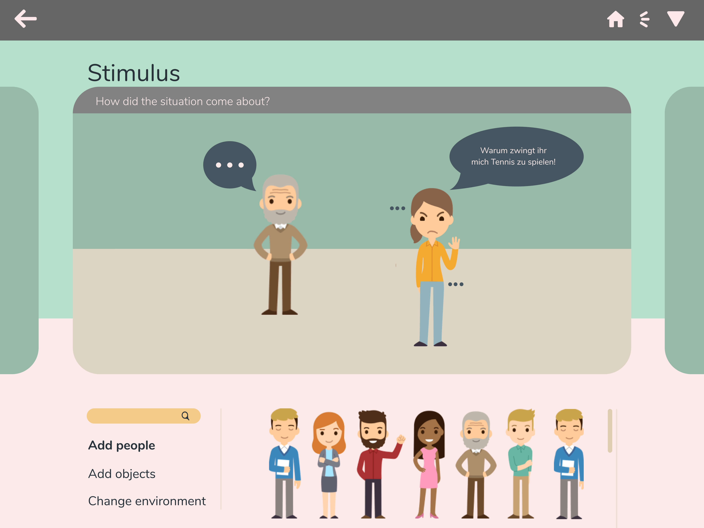
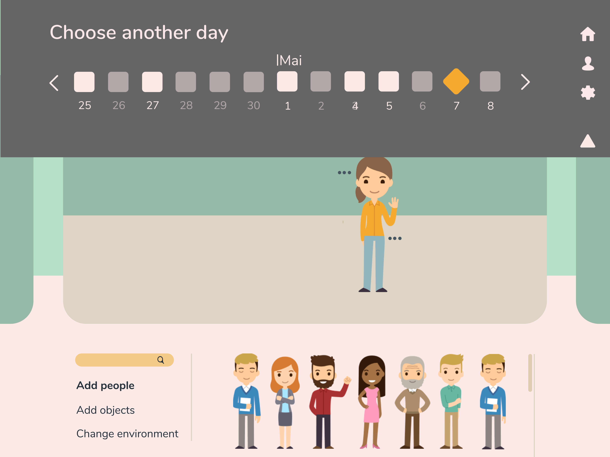
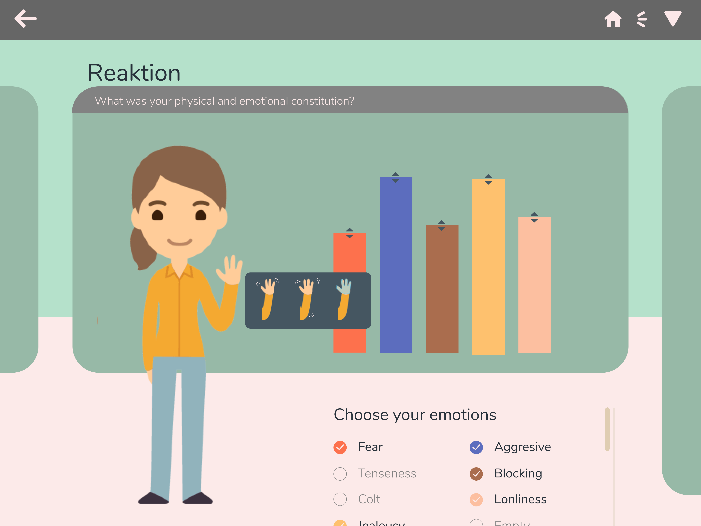
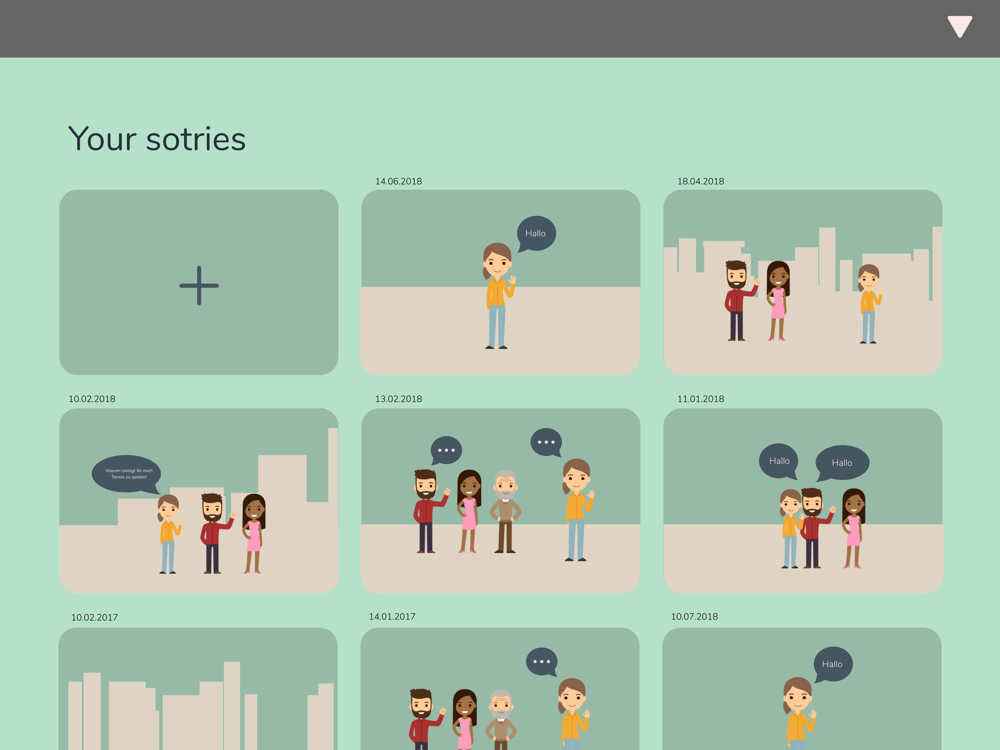

# App Design to Psychological Treatment Support

## Ziel
Patienten unter psychologischer Betreung sollen mittels einer App ihre Gefühle in Altagssituationen dokumentieren können. An psychologischen Sitzungen soll die App anschliessend dazu helfen, Vergangenen Emotionen besser wiedergeben zu können, sodass dem behandelnde Psychologen einen bessern Eindruck darüber erhält, wie die Situation abgelaufen ist.   

## Interaktiv Prototyp
https://projects.invisionapp.com/share/PWL0LWRZ5TQ#/screens/303308570_1

## Single Screens
Shows a part of the final Hi-Fi screens

Customize Me:

Customize Me 2:

Say Something:

Add New Person:

Jump To Other Day:

Customize Reaktion:

Select Story:

