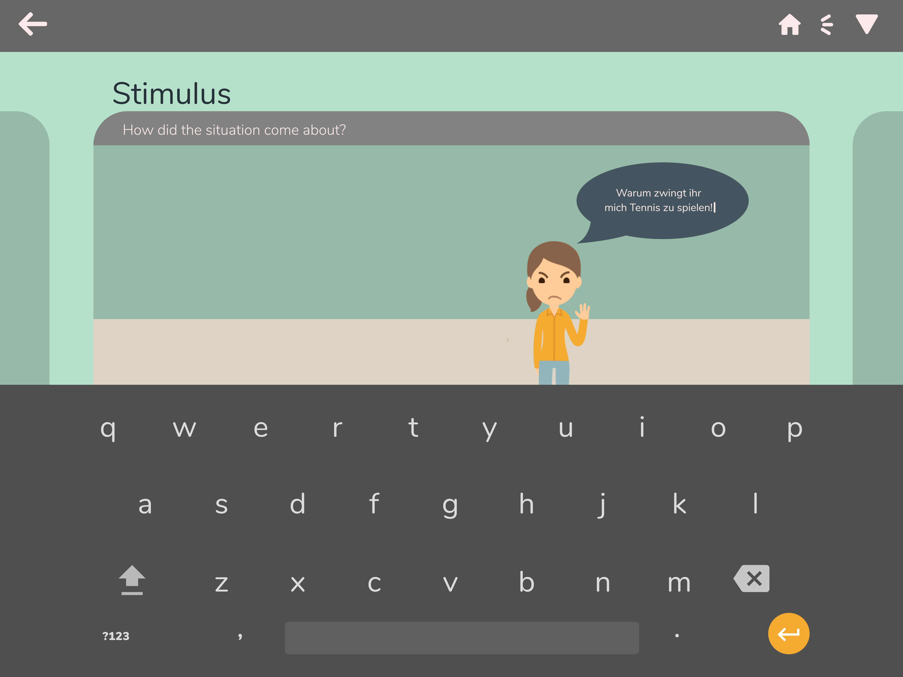

# App Visual Design: Psychological Treatment Support

## Ziel
Patienten unter psychologischer Betretung sollen mittels App ihre Gefühle aus Alltagsituationen besser dokumentieren können. An den jeweiligen therapeutischen Sitzungen soll dann zusammen mit dem behandelnden Psychologen die App dazu helfen, sich an die Vergangenen Geschichten und Emotionen besser erinnern und zu können sowie sie möglichst genau wiedergegeben zu können. 

## Idee
Statt einer simplen Parametereingabe zur Erfassung von Emotionen, habe ich eine App konzipiert, mit welcher sich die vergangene Geschichten mittels einer Comic-artigen Geschichte reproduziert lassen.  

## Interaktiv Prototyp
https://projects.invisionapp.com/share/PWL0LWRZ5TQ#/screens/303308570_1

## Single Screens
Customize Me:

Customize Me 2:

Say Something:

Add New Person:

Jump To Other Day:

Customize Reaktion:

Select Story:

